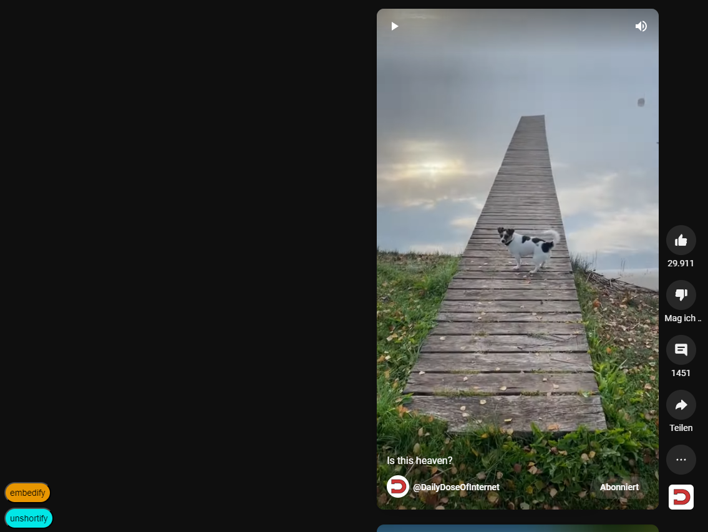
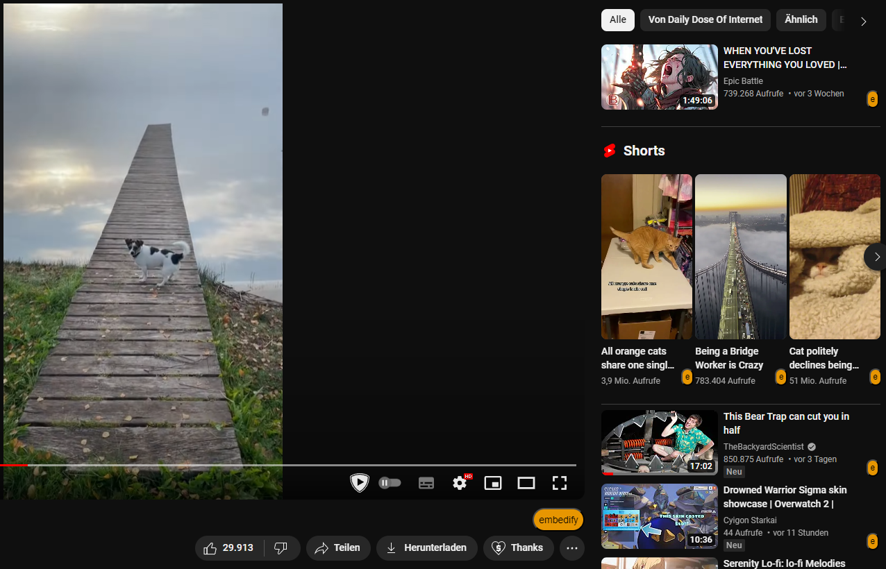

# embedify-script

**User script that adds buttons youtube to open the videos in [embedify](https://mavodeli.de/embedify).**

 

If your userscript manager supports this feature, clicking this link should prompt you to install the script:

[https://github.com/Mavodeli/embedify-script/raw/main/embedify-script.user.js](https://github.com/Mavodeli/embedify-script/raw/main/embedify-script.user.js)

(tested on [Tampermonkey](https://tampermonkey.net))

 

# This is how it looks on Youtube:
### Videos on the homescreen:

### Shorts:

 
(The unshortify button switches to the regular video player)

### Watching videos:
